# 📖 Manual de Usuario - Admin Panel (La Senda Antigua)

Este manual es una guía paso a paso para el uso del panel administrativo.

---

## 1. 🔐 Inicio de Sesión

Al acceder al panel, serás redirigido automáticamente a la pantalla de inicio de sesión de Google. Ingresa con tu cuenta autorizada.

> **Nota:** Solo los usuarios dados de alta por un administrador pueden acceder.

---

## 2. 🏠 Pantalla Principal (Home)

Al iniciar sesión, verás la pantalla principal con las siguientes opciones:

- 📡 **Broadcast**
- 🎬 **Media**
- 🗓️ **Calendars**
- 👥 **Users**
Selecciona la opción deseada desde el menú lateral o la pantalla principal.

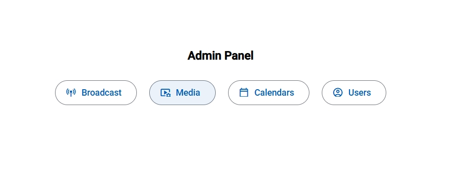

---

## 3. 📡 Broadcast

Permite gestionar y monitorear las transmisiones en vivo del sitio web.

### Opciones principales:
- Iniciar transmisión
- Gestionar tiempo en vivo
- Finalizar o cambiar estado

---

## 4. 🎬 Media

Centraliza la gestión de contenido multimedia. Al ingresar, verás las siguientes opciones:

- **Preachers** (Oradores)
- **Sermons** (Prédicas)
- **Playlists** (Listas de reproducción)
- **Courses** (Cursos)
- **Gallery** (Galería de videos)

Selecciona una opción para administrar el contenido correspondiente.

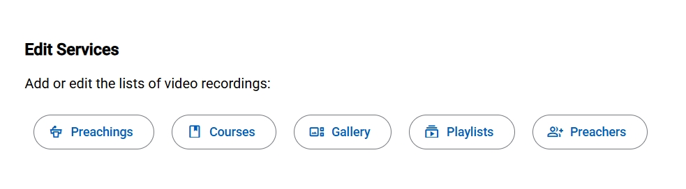

---

## 5. 🗓️ Calendars

Permite la gestión de calendarios y eventos.
---

## 6. 👥 Users

Control general de usuarios y roles para el admin panel y app móvil.

---

## 📘 Detalle de cada módulo

### 📡 Broadcast

Permite proyectar un video en directo o mostrar un mensaje informativo a los visitantes.

#### Cómo iniciar la transmisión
1. Dentro de la sección **broadcast**, se localiza el área de entrada de datos.
2. Se ingresa el código **embed** de Rumble o, en su defecto, un mensaje de texto que se desee mostrar en el sitio web.
3. Se presiona el botón **Go Live**.

#### Gestión del tiempo en vivo
*   **Contador regresivo:** Se inicia automáticamente un cronómetro de **2:30 horas**. Al agotarse el tiempo, la transmisión finaliza en el sitio web.
*   **Extensión de tiempo:** Aparece un botón para agregar **30 minutos extra**. Este botón puede presionarse tantas veces como sea necesario para prolongar la duración del vivo.

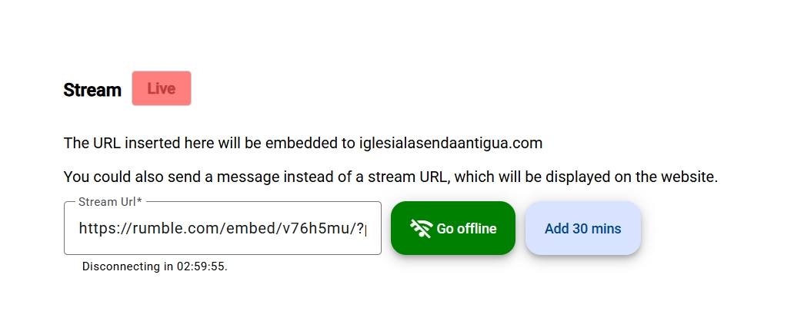

#### Finalizar o cambiar el estado
*   Para detener la señal antes de que el contador llegue a cero, se utiliza el botón de finalizar (si está disponible en la interfaz) o se limpia el contenido.
*   Si se desea cambiar el video o el mensaje mientras se está en vivo, se actualiza el campo de texto y se guardan los cambios.

---

### 🎬 Media

Al ingresar a Media, selecciona una de las siguientes opciones:
- **Preachers**
- **Sermons**
- **Playlists**
- **Courses**
- **Gallery**

#### Playlists

Permite crear y administrar listas de reproducción de videos.

**Agregar una nueva playlist:**
1. Dentro de la sección **media**, selecciona **playlists**.
2. Usa el botón con el signo más (**+**) para abrir el formulario de creación.
3. Completa los datos requeridos:
   * **Título:** Nombre de la lista de reproducción (ej. "Serie de Santidad").
4. Presiona el botón de guardar.

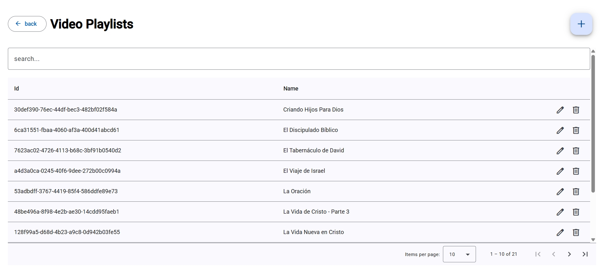

**Modificar una playlist:**
1. Localiza la lista en el listado principal.
2. Selecciona el botón de **Editar** (icono de lápiz).
3. Actualiza los datos y guarda los cambios.

**Eliminar una playlist:**
1. Presiona el icono de **Eliminar** (bote de basura) en la fila correspondiente.
2. Confirma la acción en la ventana emergente.

#### Preachers

Permite administrar los oradores vinculados a sermones y cursos.

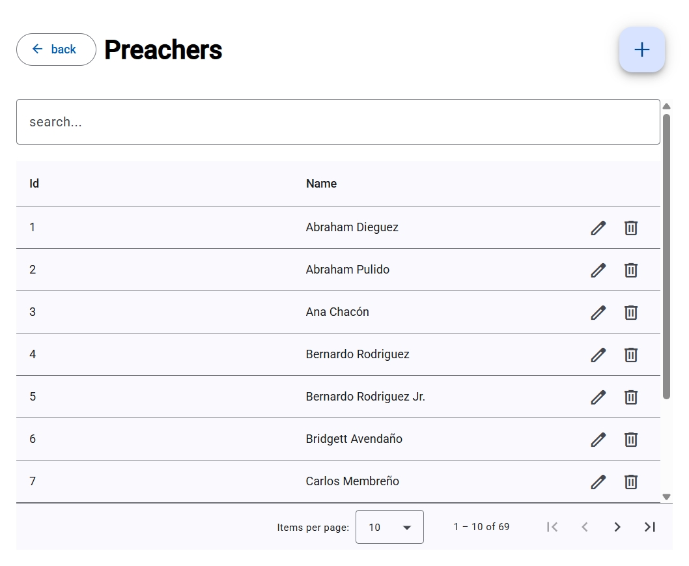

**Agrear un predicador:**
1. Dentro de **media**, selecciona **preachers**.
2. Usa el botón con el signo más (**+**) para iniciar el registro.
3. Completa los campos requeridos:
   * **Nombre:** El nombre del expositor.
4. Haz clic en guardar.

**Modificar un predicador:**
1. Localiza al predicador en el listado principal.
2. Selecciona el botón de **Editar** (icono de lápiz).
3. Realiza los cambios y guarda.

**Eliminar un predicador:**
1. Presiona el icono de **Eliminar** (bote de basura).
2. Confirma la acción en la ventana emergente.

**Regla de integridad:** No es posible eliminar a un predicador que tenga **sermones** o **lecciones de cursos** asociados. Si intentas borrarlo y el sistema lo impide, deberás primero eliminar o reasignar todo su contenido vinculado.

---

#### Sermons, Courses y Gallery

Permiten gestionar el contenido en video del portal (prédicas, enseñanzas y galería).

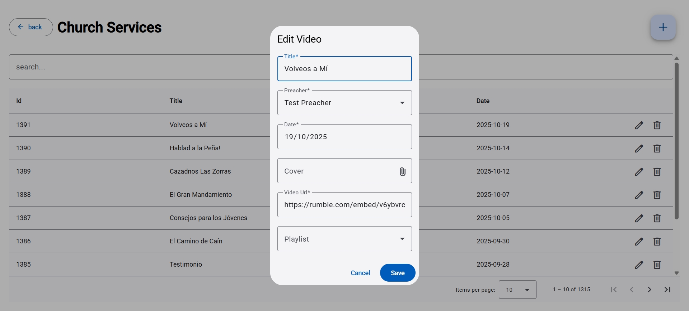

**Agregar un nuevo video:**
1. Dentro de **media**, selecciona la opción correspondiente (**sermons**, **courses** o **gallery**).
2. Haz clic en el botón con el signo más (**+**).

   * **Título:** Nombre del video o tema central.
   * **Predicador:** Selección del orador (solo en **sermons** y **courses**).
   * **Playlist:** Selección de la lista (obligatorio en **courses**).
   * **Fecha:** Fecha del mensaje.
   * **Cover:** Selecciona la imagen de portada.
   * **Video:** Código **embed** de Rumble.
4. Guarda los cambios.

**Modificar un video:**
1. Localiza el elemento en la lista principal.
2. Selecciona el botón de **Editar** (icono de lápiz).
3. Ajusta los datos y guarda.
4. Si no selecciona una nueva portada (cover), no se modificará la portada existente.

**Eliminar un video:**
1. Presiona el icono de **Eliminar** (bote de basura).
2. Confirma la acción en el mensaje de seguridad.

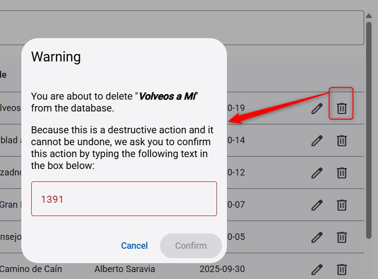

---

### 🗓️ Calendars

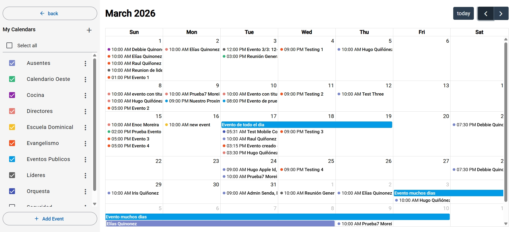

**Gestión de Grupos (Calendarios):**
1. Usa la barra lateral para añadir o modificar grupos.
   * **Nombre:** Etiqueta del grupo.
   * **Color:** Identificador visual.
   * **Privacidad y Permisos:** Configuración de visibilidad y asignación de **Managers**/**Members**.
2. Activa o desactiva la visualización de cada grupo desde la barra lateral.

**Gestión de Eventos:**
1. Usa el botón **Agregar evento** o haz clic sobre un día específico.
2. Completa el formulario:
   * **Calendar** Campo obligatorio
   * **Assignees** Campo opcional para enviar notificaciones a miembros específicos
   * **Título** El título del evento es opcional si tiene "Assignees"
   * **Descripción** Campo opcional para proporcionar detalles del evento.
   * **Horario** Campos para determinar la fecha de inicio y fin del evento.

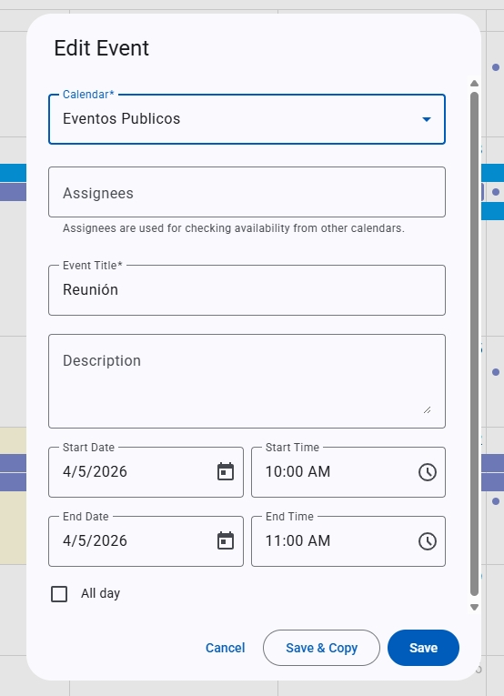

**Conflictos y Permisos:**
* El sistema identifica posibles conflictos para usuarios, los cuales se visualizan en la parte inferior del formulario.
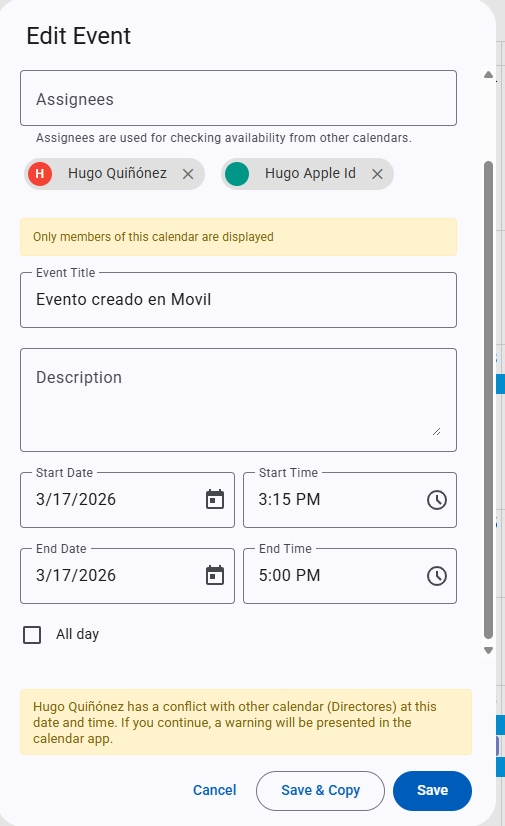
* Solo administradores o **Managers** pueden editar/mover eventos.
* Al guardar, puedes copiar datos para crear eventos similares.

---

### 👥 Gestión de Usuarios

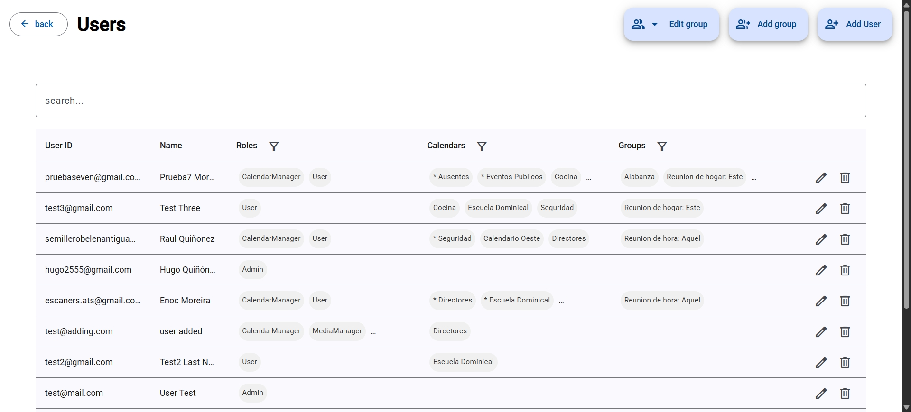

**La tabla de usuarios**

En el listado verás todos los usuarios del panel con su información:
- **User ID** - El correo de Google del usuario
- **Name** - Nombre y apellido
- **Roles** - El tipo de acceso que tiene (ej: Admin, Manager)
- **Calendars** - Los calendarios en los que puede trabajar (como administrador o miembro)
- **Groups** - Los equipos a los que pertenece

---

**Buscar y filtrar usuarios**

Puedes filtrar la tabla de varias formas:
1. Haz clic en el encabezado de cualquier columna (Roles, Calendars, Groups) para filtrar por ese criterio
2. Selecciona los valores que quieres ver (ej: mostrar solo usuarios con rol "Admin")
3. La tabla se actualiza automáticamente

---

**Agregar un nuevo usuario**

1. Presiona el botón **+ Add User** (esquina superior)
2. Completa el formulario con:
   - **User ID** - El correo de Google del usuario
   - **Nombre y Apellido** - El nombre completo
   - **Roles** - Selecciona uno o más roles (Admin, Manager, etc.)
   - **Calendars** - Elige qué calendarios puede usar y en qué nivel (Manager para editar, Member para solo ver)
   - **Groups** - Asigna el usuario a uno o varios equipos
3. Presiona **Guardar**

> **Nota:** El usuario recibirá una invitación para acceder con su cuenta de Google

---

**Modificar un usuario**

1. Localiza al usuario en la tabla
2. Presiona el icono de **Editar** (lápiz) en esa fila
3. Actualiza los campos que necesites cambiar
4. Presiona **Guardar**

---

**Eliminar un usuario**

1. Presiona el icono de **Eliminar** (bote de basura) en la fila del usuario
2. En la ventana de confirmación, **escribe el User ID** (el correo) para confirmar
3. Presiona **Confirmar eliminación**

> **Importante:** No puedes eliminar el último administrador del sistema. Si necesitas hacerlo, primero asigna permisos de admin a otro usuario.

---

**Crear y gestionar grupos de usuarios**

Los grupos permiten organizar usuarios en equipos de trabajo.

**Agregar un grupo:**
1. Presiona el botón **+ Add Group** (al lado de "Add User")
2. Escribe el nombre del grupo (ej: "Predicadores", "Coordinadores")
3. Presiona **Guardar**

**Modificar un grupo:**
1. En la lista de grupos (debajo de la tabla de usuarios), localiza el grupo
2. Presiona el icono de **Editar** (lápiz)
3. Se abre el formulario del grupo donde puedes:
   - **Cambiar el nombre** si lo necesitas
   - **Agregar miembros** - Selecciona los usuarios que quieres agregar al grupo
   - **Quitar miembros** - Deselecciona los usuarios que ya no quieres en el grupo
4. Presiona **Guardar** para aplicar los cambios

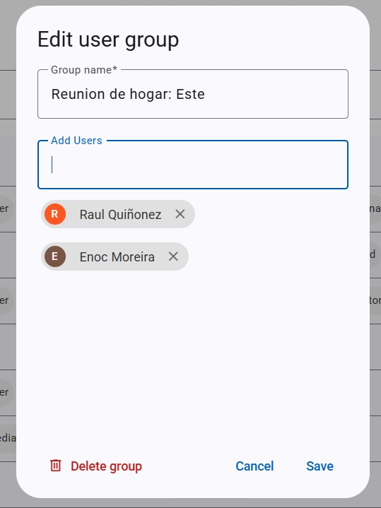

**Eliminar un grupo:**
1. En la lista de grupos, localiza el grupo
2. Presiona el icono de **Eliminar** (bote de basura)
3. Confirma la acción

---