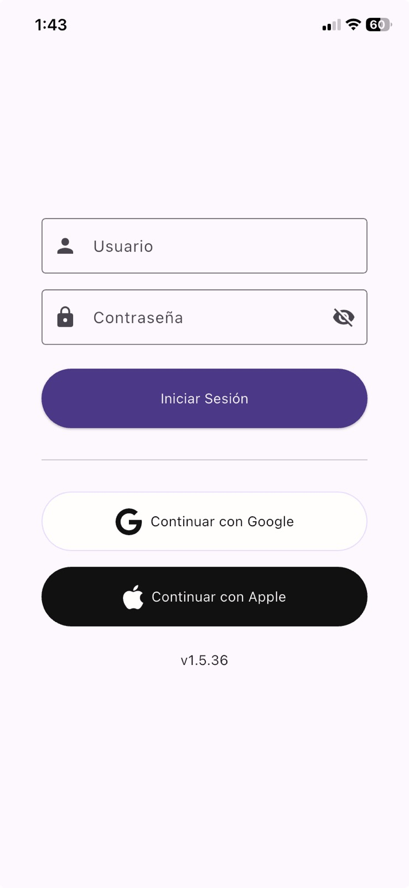
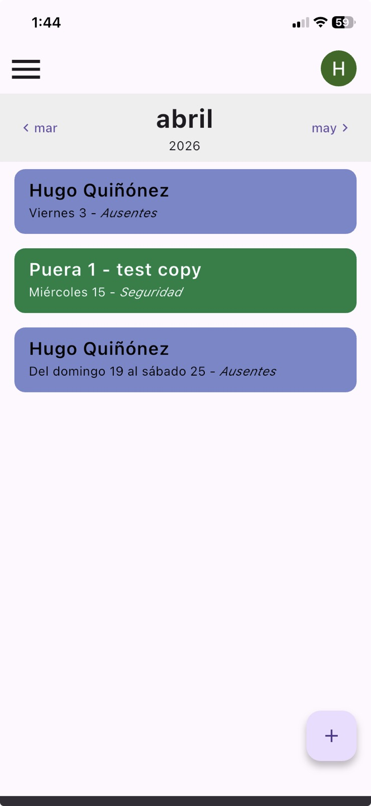
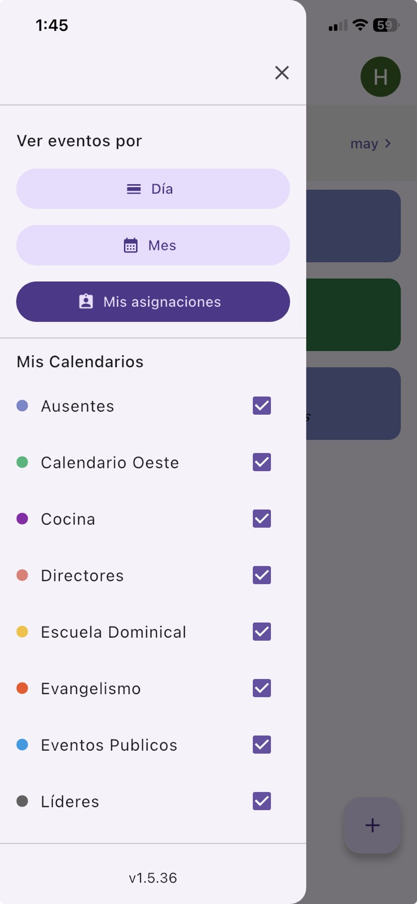
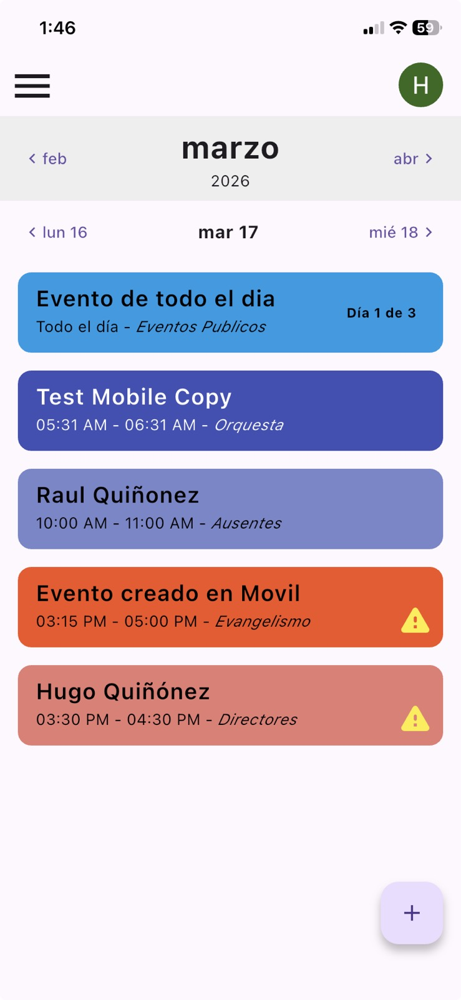
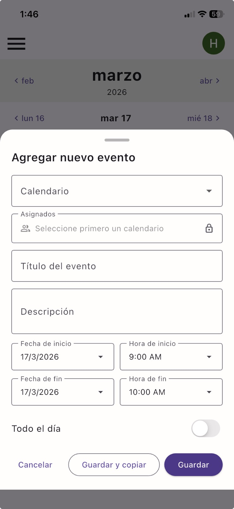
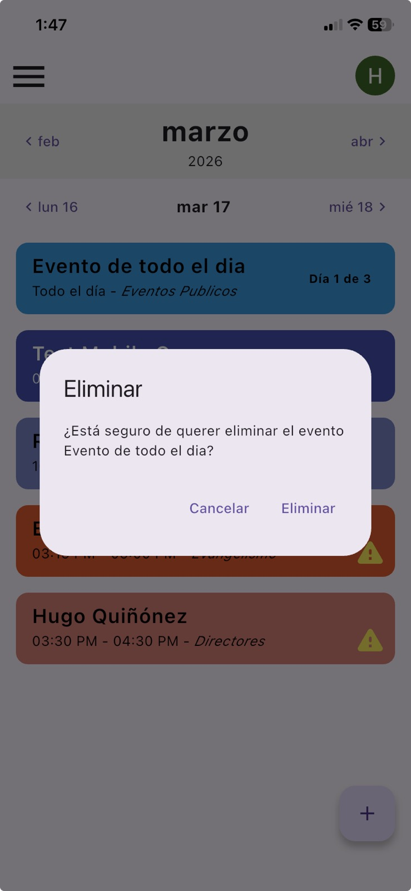
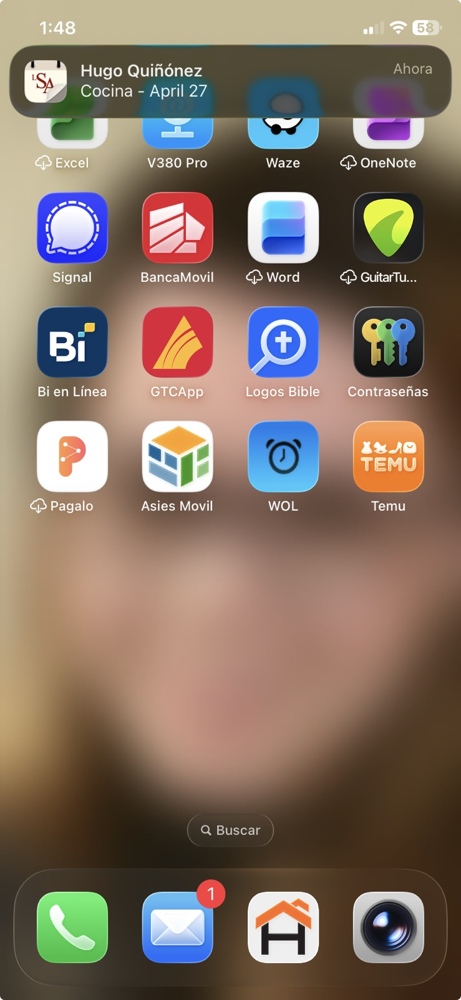

# Manual de Usuario - App de Calendario LSA
La app de Calendario, es una herramienta diseñada para gestionar calendarios y eventos de Iglesia La Senda Antigua. Permite visualizar, crear y editar eventos según los permisos del usuario, con soporte para notificaciones push y múltiples métodos de autenticación.

## 1. Instalación de la App

La aplicación de Calendario LSA está disponible para dispositivos Android e iOS. Sigue los siguientes pasos para instalarla en tu dispositivo.

### Requisitos del Sistema
- **Android**: Versión 5.0 o superior
- **iOS**: Versión 12.0 o superior
- Conexión a internet para el funcionamiento completo

### Enlaces de Descarga
- **Android (Google Play Store)**: [Descargar desde Google Play](https://play.google.com/store/apps/details?id=com.iglesialasendaantigua.calendar)
- **iOS (App Store)**: [Descargar desde App Store](https://apps.apple.com/us/app/calendario-la-senda/id6757451489)

### Pasos de Instalación
1. Haz clic en el enlace correspondiente a tu dispositivo.
2. Serás redirigido a la tienda de aplicaciones oficial.
3. Haz clic en "Instalar" o "Actualizar".
4. Espera a que se complete la descarga e instalación.
5. Una vez instalada, abre la app y sigue las instrucciones de inicio de sesión.

## 2. Inicio de Sesión

La aplicación de Calendario LSA ofrece múltiples formas de iniciar sesión para facilitar el acceso a los usuarios. Al abrir la app por primera vez, serás dirigido automáticamente a la pantalla de login.

### Métodos de Inicio de Sesión Disponibles

#### 1. Inicio de Sesión con Usuario y Contraseña
  - Ingresa tu nombre de usuario y contraseña en los campos correspondientes.
  - Haz click en "iniciar sesión"  

#### 2. Inicio de Sesión con Google
- **Requisitos**: Debes tener una cuenta de Google configurada en tu dispositivo.
- **Pasos**:
  1. Haz clic en el botón "Continuar con Google" (botón blanco con ícono de Google y texto negro).
  2. Se abrirá una ventana emergente de Google para seleccionar tu cuenta.
  3. Autoriza el acceso a tu cuenta de Google.
  4. Si la autenticación es exitosa, accederás automáticamente a la pantalla principal.

#### 3. Inicio de Sesión con Apple (solo en iOS)
- **Requisitos**: Disponible únicamente en dispositivos iOS con iOS 13 o superior.
- **Pasos**:
  1. Haz clic en el botón "Continuar con Apple" (botón negro con ícono de Apple y texto blanco).
  2. Se abrirá la ventana de autenticación de Apple ID.
  3. Autoriza el acceso usando tu huella dactilar, Face ID o código de acceso.
  4. Si la autenticación es exitosa, accederás automáticamente a la pantalla principal.

## 3. Pantalla Principal - Vista General

Una vez que inicies sesión, accederás a la pantalla principal de la app, que es el centro de gestión de calendarios y eventos. Esta pantalla está diseñada para  navegar rápidamente entre fechas, cambiar modos de vista y acceder a funciones clave.

### Elementos de la Interfaz

#### 1. Barra Superior (App Bar)
- **Botón de Menú (izquierda)**: Ícono de tres líneas horizontales (☰) en la esquina superior izquierda. Al hacer clic, abre el menú lateral.
- **Menú de Perfil (derecha)**: Un avatar circular que representa al usuario actual. Al hacer clic, se despliega un menú emergente con:
  - Nombre de usuario y correo electrónico (si está disponible).
  - Opción "Cerrar Sesión" para salir de la app.

#### 2. Navegador de Meses
- Ubicado en la parte superior del contenido principal.
- Muestra el mes y año actual (ej: "Abril 2026").
- **Botones de navegación**:
  - Flecha izquierda (◀): Retrocede al mes anterior.
  - Flecha derecha (▶): Avanza al mes siguiente.
- Al cambiar de mes, la lista de eventos se actualiza automáticamente para mostrar los eventos del mes seleccionado.

#### 3. Navegador de Fechas (solo en modo Día)
- Aparece debajo del navegador de meses cuando estás en modo "Día" y hay eventos en el mes.
- Muestra flechas para navegar a la fecha anterior o siguiente con eventos.
- Permite saltar rápidamente a fechas específicas con actividad.

#### 4. Lista de Eventos
- Ocupa la mayor parte de la pantalla.
- Muestra los eventos según el modo de vista seleccionado y los calendarios activos.
- Cada evento se presenta en una tarjeta con información clave.
- Si no hay eventos, muestra un mensaje indicando que no hay eventos para mostrar.
- Soporta deslizar hacia abajo para refrescar los datos.

#### 5. Botón Flotante de Agregar Evento
- Ícono de "+" en un círculo azul, ubicado en la esquina inferior derecha.
- Solo visible si tienes permisos para crear eventos (roles de administrador o calendar manager).
- Al hacer clic, abre un formulario modal para crear un nuevo evento.

### Modos de Vista Disponibles
La app ofrece tres modos de vista principales, accesibles desde el drawer lateral:

#### Modo Día
- Muestra eventos del día seleccionado.
- Navegación por fechas individuales.
- Ideal para ver el horario diario detallado.

#### Modo Mes
- Muestra todos los eventos del mes en una lista.
- Eventos ordenados por fecha y calendario.
- Útil para tener una visión general mensual.

#### Modo Asignados a Mí
- Muestra solo los eventos donde apareces como asignado.
- Filtra automáticamente los eventos relevantes para ti.
- Perfecto para enfocarte en tus responsabilidades.

### Navegación por Fechas y Meses
- **Cambio de mes**: Usa los botones del navegador de meses para moverte entre meses. La app cargará automáticamente los eventos del nuevo mes.
- **Navegación en modo Día**: Si hay eventos en fechas adyacentes, aparecerán flechas para navegar rápidamente.
- **Carga automática**: Al cambiar de mes, la app busca eventos en el mes actual y, si no los encuentra, en meses futuros hasta encontrar actividad.

## 4. Menú de Calendarios

1. Desde la pantalla principal, toca el ícono de menú (☰) en la esquina superior izquierda de la barra.
2. Se abrirá el drawer lateral desde el lado izquierdo de la pantalla.
3. El drawer contiene dos secciones principales: modos de vista y lista de calendarios.

### Ver Calendarios Disponibles
- En la sección "Mis Calendarios", verás una lista de todos los calendarios a los que tienes acceso.

### Seleccionar/Deseleccionar Calendarios
- **Seleccionar un calendario**: Marca el checkbox junto al nombre del calendario. Los eventos de ese calendario aparecerán en la lista principal.
- **Selección múltiple**: Puedes tener varios calendarios seleccionados simultáneamente.

### Tipos de Calendarios
- **Calendarios públicos**: Accesibles por todos los usuarios.
- **Calendarios privados**: Restringidos a miembros específicos.
- **Calendarios ocultos**: Solo visibles para administradores y managers.

### Permisos y Roles
La visibilidad y gestión de calendarios depende de tu rol en el sistema:

#### Usuario Normal
- Puedes ver calendarios públicos y aquellos donde eres miembro.
- Solo puedes seleccionar/deseleccionar calendarios para filtrar eventos.
- No puedes crear o modificar calendarios.

#### Calendar Manager
- Acceso a calendarios donde eres designado como manager.
- Puedes crear, editar y eliminar eventos en calendarios que gestionas.
- Puedes asignar miembros a eventos dentro de tus calendarios.

#### Administrador (Admin)
- Acceso completo a todos los calendarios del sistema.
- Puedes gestionar cualquier calendario y evento.
- Tiene permisos para crear nuevos calendarios y modificar configuraciones globales.

## 5. Visualización de Eventos

Los eventos son las actividades o compromisos programados dentro de los calendarios. La app proporciona múltiples formas de visualizar eventos, cada una optimizada para diferentes necesidades y contextos. Los eventos se muestran de manera diferente según el modo de vista seleccionado.

### Cómo se Muestran los Eventos en Cada Modo de Vista

#### Modo Día
- Muestra todos los eventos del día seleccionado en una lista vertical.
- Los eventos aparecen en orden cronológico (ordenados por hora de inicio).

#### Modo Mes
- Muestra todos los eventos del mes seleccionado en una lista.
- Los eventos se ordenan por:
  1. Calendario (por orden de aparición en la lista)
  2. Fecha (dentro del mismo calendario)
  3. Hora de inicio

#### Modo Asignados a Mí
- Muestra solo los eventos donde el usuario actual aparece como asignado.
- Los eventos se filtran automáticamente por:
  1. Calendarios seleccionados (respeta tu selección de calendarios activos).
  2. Presencia del usuario como asignado.
- Se ordenan por fecha y hora de inicio.

### Información Mostrada por Evento
Cada evento en la lista se presenta como una tarjeta con los siguientes elementos:

#### Información Básica
- **Título del evento**: Nombre principal del evento en texto destacado.
- **Descripción**: Visible al hacer click sobre la tarjeta del evento. 
- **Calendario**: Indica a qué calendario pertenece el evento (con el color distintivo del calendario).

#### Personas Asignadas
- **Asignados**: Lista de usuarios asignados al evento. Cada asignado se muestra con:
  - Nombre completo (si está disponible).
  - Avatar o inicial del nombre.
  - Rol (User, Calendar Manager, Admin, etc.).

#### Indicadores Visuales
- **Color del calendario**: Un cuadrado o línea de color representa el calendario del evento.
- **Conflictos**: Si hay conflictos de horario con otros eventos, se indica visualmente.

### Navegación Entre Eventos con Fechas

#### Navegador de Fechas (Modo Día)
- Aparece debajo del mes cuando hay eventos en el mes actual.
- Muestra:
  - **Flecha izquierda (◀)**: Navega a la última fecha anterior con eventos.
  - **Flecha derecha (▶)**: Navega a la próxima fecha posterior con eventos.
- Al tocar una flecha, la vista se actualiza al día seleccionado automáticamente.
- Las flechas se desactivan si no hay fechas disponibles en esa dirección.

#### Cambio de Mes
- Usa los botones "◀" y "▶" del navegador de meses.
- La lista de eventos se actualiza automáticamente al nuevo mes.
- Si el mes no tiene eventos, la app busca automáticamente el próximo mes con eventos y salta a ese mes.

## 6. Creación y Edición de Eventos

La creación y edición de eventos es una funcionalidad central de la app. Ambas operaciones utilizan el mismo formulario modal, con algunas diferencias importantes.

### Requisitos para Crear Eventos
- **Permisos requeridos**: 
  - Debes tener rol de **Administrador (Admin)** o **Calendar Manager** en al menos un calendario.
  - Si eres usuario normal, el botón flotante de "+" no será visible.
- **Acceso al formulario**:
  - Toca el botón flotante azul con el ícono "+" en la esquina inferior derecha de la pantalla principal.
  - El botón solo aparece si tienes permisos suficientes.

### Formulario de Creación/Edición de Eventos

Para crear un nuevo evento,, se selecciona el botón flotante azul con el ícono "+" y para editar un evento existente, se desliza hacia la izquierda la tarjeta, y se selecciona el ícono de lápiz (editar).
El formulario modal se abre desde la parte inferior de la pantalla. Contiene los siguientes campos:

#### 1. Campo de Calendario (Requerido)
- **Descripción**: Selecciona el calendario en el que deseas crear o editar el evento.
- **Comportamiento**:
  - Solo aparecen los calendarios donde tienes permisos de manager.
  - Este es un campo obligatorio para crear un evento.
  - Al cambiar de calendario, se limpian automáticamente los asignados (para evitar asignaciones inválidas).
- **Validación**: Si intentas guardar sin seleccionar un calendario, aparecerá un mensaje: "Calendar is required".

#### 2. Campo de Asignados (Opcional)
- **Descripción**: Selecciona uno o múltiples usuarios para asignar al evento.
- **Comportamiento**:
  - Se desbloquea solo después de seleccionar un calendario.
  - Muestra "Selecciona un calendario primero" si no hay calendario seleccionado.
  - Toca el campo para abrir un selector de usuarios en una hoja modal.
- **Filtrado de usuarios**:
  - Se muestran solo usuarios que son miembros del calendario seleccionado o administradores.  
- **Múltiples asignados**:
  - Puedes seleccionar varios usuarios a la vez.
  - Los asignados aparecen como "chips" (etiquetas) debajo del campo.  
- **Grupos de usuarios**:
  - Además de usuarios individuales, puedes seleccionar grupos de usuarios.
  - Al seleccionar un grupo, se añaden todos los miembros del grupo como asignados.
- **Remover asignados**:
  - Toca la "X" en cualquier chip para remover un asignado específico.

#### 3. Campo de Título (Requerido si no hay asignados)
- **Descripción**: Nombre o descripción corta del evento.
- **Validación**: 
  - Si no hay asignados, el título es obligatorio.
  - Si hay al menos un asignado, el título puede estar vacío (la app lo permitirá).

#### 4. Campo de Descripción (Opcional)
- **Descripción**: Detalles adicionales sobre el evento.

#### 5. Fecha y Hora de Inicio (Requeridas)
- **Fecha de inicio**:
  - Selecciona la fecha en la que comienza el evento.
  - Se abre un selector de fecha al tocar el campo.  
- **Hora de inicio** (solo si no es "todo el día"):
  - Selecciona la hora en la que comienza el evento.
  - Se abre un selector de hora en formato 12 horas (AM/PM).  
- **Valor predeterminado**:
  - Para nuevos eventos: Fecha actual a las 10:00 AM.
  - Para eventos editados: Se mantiene la fecha/hora original.

#### 6. Fecha y Hora de Finalización (Requeridas)
- **Fecha de finalización**:
  - Selecciona la fecha en la que termina el evento.
  - **Bloqueo importante**: La fecha de finalización NO puede ser anterior a la fecha de inicio.
  - Si intentas establecer una fecha de finalización anterior, la app ajustará automáticamente la fecha al mismo día del inicio.
- **Hora de finalización** (solo si no es "todo el día"):
  - Selecciona la hora en la que termina el evento.
  - **Bloqueo importante**: La hora de finalización NO puede ser anterior a la hora de inicio en el mismo día.
  - Si configuras una hora de finalización anterior a la de inicio, la app ajustará automáticamente la hora respetando la duración original del evento.
- **Mantenimiento de duración**:
  - Cuando editas un evento existente y cambias la fecha o hora de inicio, la app intenta mantener la duración original.
  - Ejemplo: Si un evento duraba 2 horas y cambias la hora de inicio a las 14:00, el final se ajustará a las 16:00.
- **Valor predeterminado**:
  - Para nuevos eventos: 1 hora después del inicio.
  - Para eventos editados: Se mantiene la fecha/hora original.

#### 7. Opción "Todo el Día" (Toggle)
- **Descripción**: Convierte el evento en un evento de todo el día, sin horarios específicos.
- **Comportamiento al activar**:
  - Los campos de hora de inicio y fin desaparecen automáticamente.
  - Solo se muestran los campos de fecha.

### Validación de Disponibilidad (Detección de Conflictos)
- **Funcionamiento automático**:
  - Cuando seleccionas asignados, la app verifica automáticamente su disponibilidad en el rango de fechas/horas.
  - También se verifica cuando cambias fechas, horas o asignados.
- **Indicador de conflictos**:
  - Si hay conflictos, aparece una advertencia en naranja con un ícono de alerta.
  - El mensaje especifica quién tiene conflictos y en qué calendarios.
  - Ejemplos de mensajes:
    - "Juan Pérez has a conflict with: Reuniones de Equipo"
    - "Multiple users have conflicts: Juan Pérez, María García"
- **Importancia**: Los conflictos son advertencias, no bloqueos. Puedes guardar el evento aunque haya conflictos.
- **Cálculo de conflictos**: La app excluye el evento actual (si estás editando) para evitar marcar conflictos falsos.

### Guardar vs. Guardar y Copiar

#### Botón "Guardar" (Botón azul)
- **Funcionamiento**:
  - Guarda el evento en el calendario seleccionado.
  - Cierra el formulario modal automáticamente.
  - Retorna a la pantalla principal, que se actualiza con el nuevo evento.
- **Para nuevos eventos**: Se envía una solicitud POST al servidor con los datos del evento.
- **Para eventos editados**: Se envía una solicitud PUT con los datos actualizados.
- **Después de guardar**: 
  - Si el evento es en una fecha diferente a la actual, la vista puede cambiar a esa fecha.
  - Aparece un mensaje de confirmación: "Evento guardado" o "Evento actualizado".

#### Botón "Guardar y Copiar" (Botón de contorno)
- **Funcionamiento**:
  - Guarda el evento actual en el servidor (igual que "Guardar").
  - Cierra el modal, pero reabre un nuevo formulario pre-rellenado con los datos del evento recién creado.
  - Permite crear rápidamente eventos similares.
- **Datos que se copian**:
  - Título, descripción, calendario, asignados (todos los detalles del evento guardado).
- **Casos de uso**:
  - Crear eventos recurrentes manualmente.
  - Crear múltiples eventos similares en diferentes fechas.
  - Duplicar reuniones o actividades.
- **Cómo salir del modo "copiar"**:
  - Toca "Guardar" para guardar la copia final.
  - Toca "Cancelar" para descartar la copia y cerrar el formulario.

#### Botón "Cancelar" (Botón de texto)
- Cierra el formulario sin guardar cambios.
- Cualquier dato ingresado se pierde.
- Retorna a la pantalla principal sin actualizar eventos.

### Edición de Eventos Existentes

#### Acceso al formulario de edición
- Toca el ícono de lápiz (editar) en la tarjeta de un evento.
- Solo aparece si tienes permisos para editar el evento (eres manager del calendario).

#### Después de editar
- La pantalla se actualiza automáticamente con los cambios.
- Si cambias la fecha del evento, la vista puede cambiar a esa fecha.
- Aparece un mensaje de confirmación: "Evento actualizado".

## 7. Eliminación de Eventos

La eliminación de eventos es una operación irreversible que requiere confirmación del usuario. Solo los usuarios con permisos suficientes pueden eliminar eventos.

### Requisitos para Eliminar Eventos
- **Permisos requeridos**: 
  - Debes ser **Administrador (Admin)** del sistema, o
  - Debes ser **Calendar Manager** del calendario al que pertenece el evento.
- **Acceso al botón de eliminar**:
  - El ícono de papelera (eliminar) solo aparece en la tarjeta del evento si tienes permisos para eliminarlo.
  - Si no tienes permisos, el botón no será visible.

### Cómo Eliminar un Evento

#### Paso 1: Localiza el Evento
- En la lista de eventos, encuentra el evento que deseas eliminar.
- Desliza hacia la izquierda y selecciona el ícono de papelera (eliminar).
- Se abrirá un diálogo de confirmación.

#### Paso 2: Confirma la Eliminación
- Se mostrará un diálogo modal con:
  - **Título**: "¿Eliminar evento?"
  - **Mensaje**: "¿Estás seguro de que deseas eliminar [Nombre del evento]?"
  - **Dos botones**:
    - "Cancelar" (lado izquierdo): Descarta la eliminación y cierra el diálogo.
    - "Eliminar" (lado derecho, en rojo): Confirma la eliminación irreversible.

#### Paso 4: Evento Eliminado
- Si confirmas, el evento se elimina del servidor.
- La lista de eventos se actualiza automáticamente.
- Aparece un mensaje de confirmación: "[Nombre del evento] eliminado".
- El evento desaparece de todas las vistas (Día, Mes, Asignados).

### Observaciones Importantes

#### Reversibilidad
- **La eliminación es irreversible**: Una vez eliminado, el evento no puede recuperarse.
- No existe una papelera o historial de eliminación.
- Si eliminas un evento por error, deberás crear uno nuevo manualmente.

#### Impacto en Otros Usuarios
- Si el evento tiene múltiples asignados, la eliminación afecta a todos ellos.
- Otros usuarios verán que el evento desaparece cuando sus apps se sincronicen o refresquen.

### Permisos Detallados

#### Administrador (Admin)
- Puede eliminar cualquier evento de cualquier calendario.
- El ícono de eliminar siempre estará visible para eventos en calendarios donde es admin.

#### Calendar Manager
- Solo puede eliminar eventos de calendarios donde es designado como manager.
- El ícono de eliminar solo aparecerá en eventos de calendarios que maneja.
- No puede ver el botón de eliminar en eventos de calendarios donde no es manager.

#### Usuario Normal
- No tiene permiso para eliminar eventos.
- El ícono de papelera nunca será visible.
- Aunque intente eliminar directamente, el servidor rechazará la solicitud.

## 8. Notificaciones y Actualizaciones

La app utiliza notificaciones push para mantener a los usuarios informados sobre cambios en calendarios y eventos en tiempo real. Las actualizaciones pueden ocurrir automáticamente o manualmente según el contexto.

### Notificaciones Push

El sistema envía notificaciones a los asignados, 14 días antes de la fecha de inicio del evento. Si el evento se crea con menos de 14 días de anticipación, notificará inmediatamente a los asignados.

#### Permisos Necesarios
- **Android**: Requiere permiso "Notificaciones". Se solicita al instalar o al iniciar sesión por primera vez.
- **iOS**: Requiere permiso para notificaciones. Se solicita automáticamente al iniciar sesión.
- Si niegas el permiso, no recibirás notificaciones.

### Manejo de Conflictos de Eventos

#### Detección Automática de Conflictos
- La app detecta automáticamente conflictos de eventos a usuarios asignados
- Cuando detecta conflictos, aparece una advertencia en naranja en el formulario de creación/edición.
- El mensaje especifica:
  - Quién tiene el conflicto (nombre del usuario).
  - Con qué eventos (nombre de los eventos conflictivos).
- Ejemplo: "Juan Pérez has a conflict with: Reuniones de Equipo"

#### Indicación en Tarjetas de Eventos
- En la lista de eventos, los eventos con conflictos pueden mostrar un ícono de alerta.
- Esto indica que hay solapamientos horarios con otros eventos del mismo usuario.
- Los conflictos se muestran en todos los modos de vista (Día, Mes, Asignados).

### Idioma de la App

#### Cambio de Idioma
- **Idiomas disponibles**: Español (es) e Inglés (en).
- **Cómo cambiar**:
  1. La app detecta automáticamente el idioma de tu dispositivo.
  2. Si tu dispositivo está en español, la app mostrará todo en español.
  3. Si está en inglés, mostrará todo en inglés.

#### Actualizaciones
- **Actualizaciones automáticas**:
  - **Android**: Se actualizan automáticamente a través de Google Play (si está configurado).
  - **iOS**: Se actualizan automáticamente a través de App Store (si está configurado).
- **Actualizaciones manuales**:
  - Abre Google Play (Android) o App Store (iOS).
  - Busca "Calendario LSA" o "Calendario la Senda".
  - Toca "Actualizar" si está disponible.
- **Verificar disponibilidad de actualización**:
  - Abre la tienda de apps (Google Play o App Store).
  - Busca la app.
  - Si dice "Actualizar" hay una nueva versión disponible.

#### Importancia de Actualizar
- Las nuevas versiones incluyen correcciones de seguridad.
- Mejoramientos de rendimiento y nuevas características.
- Compatibilidad con nuevas versiones de Android/iOS.
- Se recomienda actualizar tan pronto como sea posible.
